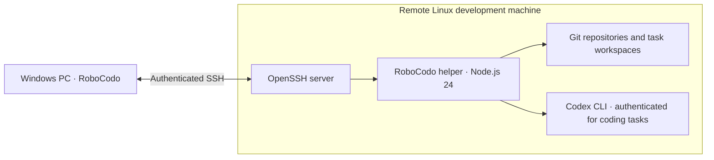
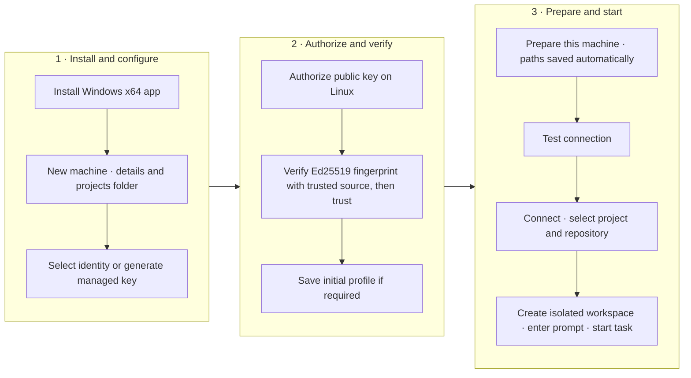

# RoboCodo

**Run Codex tasks on a remote Linux development machine from your Windows desktop.**

RoboCodo brings machine setup, isolated task workspaces, and Git change review into a Windows x64 application. Your code and Codex run on the Linux machine; RoboCodo connects to it through SSH, an encrypted remote connection. The installed Windows app does **not** require WSL.

**[Download the latest Windows installer](https://github.com/FE-Engineer-Youtube/robocodo-releases/releases/latest)** · [Getting started](docs/getting-started.md) · [Using RoboCodo](docs/using-robocodo.md) · [Troubleshooting](docs/troubleshooting.md)

## Before you install

| On your Windows computer | On your remote Linux machine |
| --- | --- |
| Windows x64 and an available OpenSSH **client** | A reachable OpenSSH **server** and a Linux user account |
| Network access to that machine's SSH port | Git and **Node.js 24**, already installed |
| An SSH identity: a RoboCodo-managed Ed25519 key, an existing SSH agent, or a private-key file | An existing, readable projects directory, such as `/home/<linux-user>/projects` |
| A trusted way to verify the server's Ed25519 fingerprint, such as its console or administrator | Codex CLI installed and authenticated as that account **for coding tasks** |

Codex is optional for basic machine preparation and Git access. Editing and creating task workspaces also require appropriate write permissions on the Linux machine. RoboCodo does **not** currently support interactive SSH password login.

## Install on Windows

1. Open the [latest public release](https://github.com/FE-Engineer-Youtube/robocodo-releases/releases/latest) and read its release notes.
2. Under **Assets**, download the x64 `.exe` installer, named like `RoboCodo-Setup-<version>-x64.exe`. Do not download `.blockmap` or `latest.yml` to install the app.
3. Verify that the download came from the official `FE-Engineer-Youtube/robocodo-releases` GitHub repository, then run the installer.

Releases are currently **unsigned**, so Windows may display a security or publisher warning. See [installer warnings](docs/troubleshooting.md#unsigned-windows-installer-warnings) if this happens. For a newer version, return to the latest-release page; the presence of update metadata is not a promise of automatic updating.

## Quick start: from prerequisites to your first task

Follow this checklist in order. The [detailed setup guide](docs/getting-started.md) explains each step, including commands to run on each computer.

1. **Prepare Windows:** check that OpenSSH is available with `ssh -V` in PowerShell.
2. **Prepare Linux:** arrange the SSH server, Git, Node.js 24, and an existing readable projects folder. Install and authenticate Codex if you want coding tasks.
3. **Install RoboCodo** using the Windows x64 `.exe` above.
4. **Add a machine:** open **Setup → Development machines → New machine**. Enter a friendly name, hostname or IP address, SSH username, SSH port, and absolute remote projects folder.
5. **Choose your SSH identity:** select an existing SSH agent/private-key file, or generate a named RoboCodo-managed Ed25519 key.
6. **Authorize the key on Linux:** if you generated a key, copy its public key and append it as a new line to the intended account's `~/.ssh/authorized_keys`, preserving existing keys. An existing identity must also be authorized. **Generating a key does not authorize it.**
7. **Verify the server:** inspect its Ed25519 fingerprint, compare it with a trusted console or administrator, then confirm and trust the verified server in RoboCodo.
8. **Save and prepare:** save the initial profile if required to make preparation available, then choose **Prepare this machine**. It automatically saves the detected working paths.
9. **Test:** choose **Test connection** and resolve any reported failures.
10. **Connect and start:** choose **Connect**, select a project and repository, create an isolated task workspace, enter a prompt, and start the task. An isolated workspace uses a separate Git worktree so the task has its own working files.

## Does Prepare machine do everything?

**No. Prepare this machine connects the app to an already prepared Linux account.**

It uses your configured SSH identity, finds existing Node.js 24 and Codex when available, verifies projects-directory access, and securely uploads, fingerprints, installs, and probes the bundled RoboCodo remote helper. It saves the working executable and helper paths in your machine profile.

It does **not** install Linux, configure the SSH server, install Git or Node.js, install or authenticate Codex, create your projects directory, authorize your public key, or decide whether to trust an unverified server fingerprint. Preparation does not require administrator/root access or install system packages.

After an application upgrade, you can prepare an existing profile again to install the newly bundled helper version. See [preparation details](docs/getting-started.md#9-prepare-this-machine).

## Keep going

- [Getting started](docs/getting-started.md): prerequisites, installation, SSH keys, server verification, and the first connection.
- [Using RoboCodo](docs/using-robocodo.md): isolated tasks, steering, review, commits, publishing, pull requests, and safe branch switching.
- [Troubleshooting](docs/troubleshooting.md): help with setup, connections, prerequisites, Git operations, and installer warnings.

## About this repository

This is the public home of RoboCodo's **Windows installers, update metadata, release notes, and user documentation**. Application source code is maintained separately in a private repository and is not included here. You do not need source-repository access to install or use RoboCodo.

Release assets include the `.exe` installer, its `.blockmap`, and `latest.yml` metadata. Users normally need only the installer.
